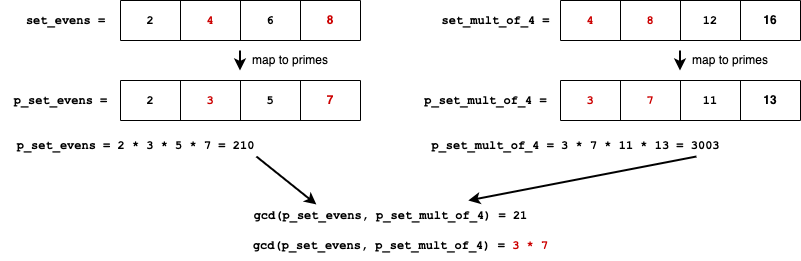
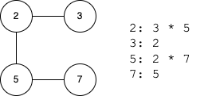

# Brian's Clique Solver

An implementation of the NP-Complete Clique Problem using prime factorization.

## Problem Statement

The version of the problem (which [Wikipedia](https://en.wikipedia.org/wiki/Clique_problem) calls `k-clique`) is described below:

> A clique in a graph G is a complete subgraph of G. That is, it is a subset K of the vertices such that every two vertices in K are the two endpoints of an edge in G.

> In the k-clique problem, the input is an undirected graph and a number k. The output is a clique with k vertices, if one exists, or a special value indicating that there is no k-clique otherwise.

In other words, the library solves this problem:

```python
def clique(G, k):
    """
    Find a subgraph of G with k vertices where each vertex is connected to
    every other vertex. Return the indices of the subgraph if one is found, or
    None.

    Args:
        G: The graph.
        k: The size of the clique.
    """
```

## Theory

### 1. Composite numbers are actually just sets

You can take any set and map the unique elements of that set to prime numbers. Then you can build a representation of that set by multiplying all of the prime numbers together.

Numbers uniquely divide into a prime decomposition. We can exploit this property to do set operations. For example, a set intersection is the same thing as a [GCD](https://en.wikipedia.org/wiki/Greatest_common_divisor) (greatest common divisor).



Note that order is not preserved here because multiplication is commutative.

### 2. Graphs could also be reduced similarly

What if we mapped every vertex in a graph to a unique prime number? We could then multiply all of the neighboring vertices together to get a single composite number.



### 3. `k-clique` as the GCD of `k` vertices

If we include the source node in its composite representation, we then end up with an interesting property, which is that a clique of size `k` is just finding `k` numbers with the same divisor.


## Algorithm

1. Represent the input graph as a map `m = {v: c}` where `v` is a unique prime number for each vertex, and `c` is a composite number composed of the product of all reachable nodes. For instance, if `v0` has edges to `v1`, `v2`, `c0 = v0 * v1 * v2`.
2. For each value `c`, calculate all of its divisors. Each divisor will appear at most once per value `c`. Record the total number of times that each divisor appears in a map.
3. **The meat of the algorithm.** Each divisor `d` is a clique candidate, so we'll do the following checks:
    1. Check whether the divisor has appeared more than `k` times.
    2. Check whether the divisor has `>=k` vertices `v_x` that fit this criteria:
        * `d` is divisible by the vertex `v_x`. This tells us whether that vertex is part of the clique.
        * `c_x` is divisible by `d`. This tells us whether the vertex can view the whole clique.
    3. If we found at least `k` vertices in step 2, that's the clique! Return it and halt. Otherwise, move on to the next one.

## Runtime Complexity

The runtime complexity appears to be driven by total number of divisors. Each vertex composite `c` has at most `2^p` divisors where `p` is the number of prime factors. The number of divisors for a number in general is given by the formula:

    d(n) = (a+1)(b+1)(c+1)...

where `a`, `b`, `c`, ... are the exponents of the prime decomposition. In our algorithm, each prime exponent is only ever 1, so the maximum total number of divisors is `2^E` where `E` is the total number of edges connected to a vertex.

Based on this, the runtime complexity that Clay Institute will hold me to is something like:

    O(V * 2^E)

In practice, this only gets bad if one node has a _ton_ of edges. Refining the complexity a bit more, if we take `E_worst` to be the total number of edges connected to the busiest node, the runtime complexity is:

    O(V * 2^E_worst)

## Empircal Results

On my 6 year old macbook, I can run the `datasets/5000x20000_8clique.txt` (5,000 vertices x 20,000 edges) testcase in 40s

```
$ python clique.py datasets/5000x20000_8clique.txt
Total number of divisors: 31176199
[83, 899, 1480, 2629, 2899, 3776, 4354, 4911]
RUNTIME: 39.30s
```