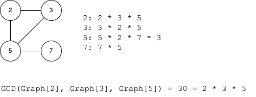

# Overview

This project is a sandbox of NP-Complete problems.

Generic usage:
```
$ python src/main.py <problem> <algorithm> [ARGS...]
```

Where:
* `problem` is a class of NP-Complete problem, (i.e. `clique`)
* `algorithm` is an algorithm implementation that solves the problem (see `src/algos`)


# `clique`

## Problem Statement

The version of the problem (which [Wikipedia](https://en.wikipedia.org/wiki/Clique_problem) calls `k-clique`) is described below:

> A clique in a graph G is a complete subgraph of G. That is, it is a subset K of the vertices such that every two vertices in K are the two endpoints of an edge in G.

> In the k-clique problem, the input is an undirected graph and a number k. The output is a clique with k vertices, if one exists, or a special value indicating that there is no k-clique otherwise.

In other words, the solvers take the form:

```python
def clique(G, k):
    """
    Find a subgraph of G with k vertices where each vertex is connected to
    every other vertex. Return the indices of the subgraph if one is found, or
    None.

    Args:
        G: The graph.
        k: The size of the clique.
    """
```

<details>
  <summary><b>clique1</b>: An implementation of the NP-Complete Clique Problem using prime factorization.</summary>

  ## Theory

  ### 1. Composite numbers are actually just sets

  You can take any set and map the unique elements of that set to prime numbers. Then you can build a representation of that set by multiplying all of the prime numbers together.

  Numbers uniquely divide into a prime decomposition. We can exploit this property to do set operations. For example, a set intersection is the same thing as a [GCD](https://en.wikipedia.org/wiki/Greatest_common_divisor) (greatest common divisor).

  

  Note that order is not preserved here because multiplication is commutative.

  ### 2. Graphs could also be reduced similarly

  What if we mapped every vertex in a graph to a unique prime number? We could then multiply all of the neighboring vertices together to get a single composite number.

  

  ### 3. `k-clique` as the GCD of `k` vertices

  If we include the source node in its composite representation, we then end up with an interesting property, which is that a clique of size `k` is just finding `k` numbers with the same divisor.

  

  ## Algorithm

  1. Represent the input graph as a map `m = {v: c}` where `v` is a unique prime number for each vertex, and `c` is a composite number composed of the product of all reachable nodes. For instance, if `v0` has edges to `v1`, `v2`, `c0 = v0 * v1 * v2`.
  2. For each value `c`, calculate all of its divisors. Each divisor will appear at most once per value `c`. Record the total number of times that each divisor appears in a map.
  3. **The meat of the algorithm.** Each divisor `d` is a clique candidate, so we'll do the following checks:
      1. Check whether the divisor has appeared more than `k` times.
      2. Check whether the divisor has `>=k` vertices `v_x` that fit this criteria:
          * `d` is divisible by the vertex `v_x`. This tells us whether that vertex is part of the clique.
          * `c_x` is divisible by `d`. This tells us whether the vertex can view the whole clique.
      3. If we found at least `k` vertices in step 2, that's the clique! Return it and halt. Otherwise, move on to the next one.

  ## Runtime Complexity

  The runtime complexity appears to be driven by total number of divisors. Each vertex composite `c` has at most `2^p` divisors where `p` is the number of prime factors. The number of divisors for a number in general is given by the formula:

      d(n) = (a+1)(b+1)(c+1)...

  where `a`, `b`, `c`, ... are the exponents of the prime decomposition. In our algorithm, each prime exponent is only ever 1, so the maximum total number of divisors is `2^E` where `E` is the total number of edges connected to a vertex.

  Based on this, the runtime complexity that Clay Institute will hold me to is something like:

      O(V * 2^E)

  In practice, this only gets bad if one node has a _ton_ of edges. Refining the complexity a bit more, if we take `E_worst` to be the total number of edges connected to the busiest node, the runtime complexity is:

      O(V * 2^E_worst)

  ## Empircal Results

  On my 6 year old macbook, I can run the `datasets/5000x20000_8clique.txt` (5,000 vertices x 20,000 edges) testcase in 40s

  ```
  $ python src/main.py clique clique1 --filename=datasets/5000x20000_8clique.txt -k 8
  Total number of divisors: 31176199
  [83, 899, 1480, 2629, 2899, 3776, 4354, 4911]
  ```

</details>

---

<details>
  <summary><b>clique2</b>: Trivial (but very fast) solver of the same problem.</summary>

  This algorithm builds up cliques one by one. Find all cliques of size `N=2`, and then use that list to build all cliques of size `N=3`, etc.

  Example with 10 million vertices and 100 million edges, and one clique of size 8 hidden in the graph.
  ```
  $ python src/main.py clique clique2 --add-clique=6 --vertices=1000 --edges=10000 -k 6
  ...
  {{
      "vertices": [
          626,
          647,
          84,
          480,
          926,
          240
      ]
  }}
  ```

</details>


# 3-Sat

## Problem Statement

The Boolean Satisfiability Problem involves finding values for a set of boolean variables that cause a boolean expression to evaluate to True. Its simplified version `3-sat` is a boolean expression consisting of a chain of OR statements ANDed together, with a maximum of 3 boolean variables per statement. For example:

    (A or B or C) and (!A or B or !C) and (!A or !B or !C)

    A = True
    B = True
    C = False

Solutions to this problem take the form:

```python
def solve(problem: sats.SatProblem) -> sats.AnswerKey:
    """
    Given a list of boolean expressions, find a solution that evaluates the
    expression to True.

    Args:
        problem: The SAT problem.

    Returns: A map of variables to their True/False value.
    """
```

<details>
  <summary><b>3sat1</b>: A trivial brute-force implementation</summary>

  This algorithm builds up a valid solution one expression at a time, keeping track of all of the possible solutions at each step.

  Brief description:

  1. Initialize a list of valid solutions `S` and initialize it with one empty solution (no variables, no values)
  2. For each expression:
        1. Compute all of the valid value combinations `C` that satisfy this expression.
        2. For each existing solution `S` and each combination `C` from above, update `S` to be the combination of `S * C`, throwing out any S & C pairs that are incompatible.
  3. Return the list of remaining valid solutions, if any.

</details>

---

<details>
  <summary><b>3sat2</b>: Optimizing-away independent solutions</summary>

  This algorithm builds off of `3sat1` except attempts to prune "independent" expressions.

  ## Brief Explanation

  Consider an expression:

      (A or B or C) and (B or !C or !D) and (!B or C or !D)

  `A` only appears once in the entire problem, so we can set it to True right away and eliminate any possibilities. There might be a solution where `A` is `False`, but it doesn't matter. If there are any solutions at all, oen of them will set `A=True`.

  Because of this, we can actually just assume that entire expression is also `True` and so will be irrelevant to the rest of hte solution. Setting `A=True` means we can delete this expression and just solve the rest of the problem.

  We can actually do better than that though. `D` only appears in that problem as `!D`. Even though it appears in multiple expressions, and because it always appears in the same form, we can set `D=False` as part of the same solution. Using the same logic as above, we can also remove those expressions and just solve the rest. A variable that only appears in one way (either positive or negative) is _independent_.

  To summarize - we can delete all expressions that have at least 1 independent variable and just solve the subproblem that remains.

  ## Algorithm

  1. For each variable in each expression, record whether that variable appears as a positive or a negative.
  2. List out the variables that only appear as either positive OR negative (not both). Record them in a solution map corresponding to their positive/negative value.
  3. For each expression, if it contains _any_ independent variables, delete it.
  4. Run the `3sat1` algorithm above for the subproblem that remains and append it to the solution from step 2.

</details>
